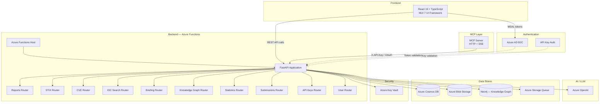
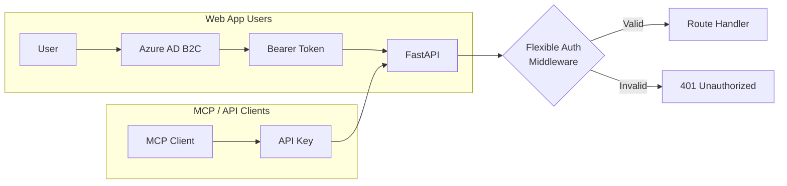

# Architecture

This document describes the high-level technical architecture of TI Mindmap HUB without exposing secrets or sensitive configuration.

---

## System Overview



---

## Technology Stack

### Backend

| Layer | Technology | Purpose |
|-------|-----------|---------|
| Runtime | Azure Functions (Python) | Serverless hosting and scaling |
| Framework | FastAPI | REST API with async support |
| LLM | Azure OpenAI | Content analysis, extraction, synthesis |
| Primary Database | Azure Cosmos DB | Reports, users, API keys, STIX bundles |
| Object Storage | Azure Blob Storage | Raw articles, generated assets |
| Queue | Azure Storage Queue | Asynchronous processing pipeline |
| Graph Database | Neo4j | STIX Constellation knowledge graph |
| Secrets | Azure Key Vault | Secure credential management |
| Auth | Azure AD B2C + API Keys | User authentication and MCP access |

### Frontend

| Layer | Technology | Purpose |
|-------|-----------|---------|
| Framework | React 19 | Component-based UI |
| Language | TypeScript | Type-safe development |
| UI Library | MUI 7 (Material UI) | Design system and components |
| Auth | MSAL React | Azure AD B2C integration |
| Routing | React Router 7 | Client-side navigation |
| Charts | Recharts, D3 | Statistics and analytics visualizations |
| Graph Viz | Cytoscape, React Force Graph 3D, XY Flow | STIX graph and knowledge graph rendering |
| Mindmaps | Mermaid | Interactive threat model diagrams |
| PDF Export | jsPDF + html-to-image | Report export capabilities |
| Data Fetching | SWR | Caching and revalidation |

### Deployment

| Component | Platform |
|-----------|----------|
| Backend API | Azure Functions (Consumption/Flex) |
| Frontend | Azure Static Web Apps |
| MCP Server | Dedicated endpoint on backend |

---

## Backend Architecture

The backend is organized as a FastAPI application hosted inside Azure Functions:

```
backend/
├── function_app.py          # Azure Functions entry point and legacy routes
├── app/
│   ├── main.py              # FastAPI app, middleware, router registration
│   ├── api/                 # API routers (one per domain)
│   │   ├── health_router.py
│   │   ├── reports_router.py
│   │   ├── submissions_router.py
│   │   ├── user_router.py
│   │   ├── statistics_router.py
│   │   ├── ioc_search_router.py
│   │   ├── briefing_router.py
│   │   ├── cve_router.py
│   │   ├── api_keys_router.py
│   │   ├── stix_router.py
│   │   └── kg_router.py
│   ├── core_logic/          # Business logic services
│   │   ├── summary_service.py
│   │   ├── mindmap_service.py
│   │   ├── ttp_service.py
│   │   ├── mitre_service.py
│   │   ├── five_whats_service.py
│   │   ├── cve_service.py
│   │   ├── ioc_service.py
│   │   ├── enhanced_ioc_service.py
│   │   ├── ioc_search_service.py
│   │   ├── stix_service.py
│   │   ├── stix_bundle_orchestrator.py
│   │   ├── stix_relationship_generator.py
│   │   ├── briefing_service.py
│   │   ├── statistics_service.py
│   │   └── dashboard_summary_service.py
│   ├── models/              # Pydantic data models
│   └── utils/               # Shared utilities
│       ├── auth.py
│       ├── cosmos_client.py
│       ├── neo4j_client.py
│       ├── llm_client_wrapper.py
│       ├── logging_config.py
│       └── usage_events.py
```

### API Endpoints

| Prefix | Router | Description |
|--------|--------|-------------|
| `/api/health` | health_router | Health checks and status |
| `/api/reports` | reports_router | Report CRUD and content retrieval |
| `/api/submissions` | submissions_router | Article submission pipeline |
| `/api/users` | user_router | User profile management |
| `/api/statistics` | statistics_router | Platform-wide KPIs |
| `/api/iocs` | ioc_search_router | Cross-report IOC search |
| `/api/briefings` | briefing_router | Weekly briefing access |
| `/api/cves` | cve_router | CVE search and enrichment |
| `/api/api-keys` | api_keys_router | API key lifecycle management |
| `/api/stix` | stix_router | STIX 2.1 bundle endpoints |
| `/api/kg` | kg_router | Knowledge Graph queries (Neo4j) |

---

## Frontend Architecture

The React frontend is a single-page application with the following page structure:

| Page | Route | Description |
|------|-------|-------------|
| Landing | `/` | Public landing page |
| Dashboard | `/dashboard` | Main report listing with filters |
| Report Detail | `/report/:id` | Per-article multi-tab analysis view |
| IOC Search | `/ioc-search` | Cross-report indicator search |
| CVE Search | `/cve-search` | Vulnerability search and enrichment |
| Knowledge Graph | `/knowledge-graph` | STIX Constellation explorer |
| STIX Bundles | `/stix-bundles` | Browse and download STIX bundles |
| Weekly Briefing | `/briefing` | AI-generated weekly threat landscape |
| Statistics | `/statistics` | Platform-wide metrics and charts |
| Analytics | `/analytics` | Cross-source intelligence reports |
| Submit Article | `/submit` | Manual URL submission |
| MCP Integration | `/mcp` | MCP setup documentation |
| Profile | `/profile` | User profile and API key management |

### Key Components

- **Layout** — Responsive navigation shell with sidebar
- **MermaidDiagram** — Renders AI-generated threat mindmaps
- **StixVisualization / STIX** — Interactive STIX graph with Cytoscape
- **DiamondModel** — Diamond Model of Intrusion rendering
- **AttackFlow** — TTP execution order visualization
- **MitreHeatmap** — ATT&CK tactic × technique heatmap
- **CVETable** — Enriched vulnerability table
- **IOCTable / HybridIOCTable** — Indicator tables with export
- **FiveWhatsTable** — Structured 5W root-cause analysis
- **TTPsTable / TTPsExecutionOrder** — MITRE ATT&CK mapping views
- **PdfExportButton** — Per-report PDF generation

---

## Authentication Model



The backend uses a **flexible authentication** model:

- **Web application users** authenticate via Azure AD B2C and send Bearer tokens
- **MCP clients and API integrations** authenticate via `X-API-Key` headers
- API keys are managed per-user from the Profile page (format: `tim_xxxxxxxxxxxx`)
- Keys are hashed (SHA-256) before storage in Cosmos DB; only the prefix is stored in cleartext

---

## Data Flow

1. **Ingestion** — Articles enter via RSS monitoring (`function_app.py`) or user submission
2. **Queuing** — Azure Storage Queue decouples ingestion from processing
3. **Processing** — Azure OpenAI extracts summaries, IOCs, TTPs, CVEs, mindmaps, STIX objects
4. **Storage** — Cosmos DB stores structured data; Blob Storage holds raw content and assets
5. **Graph Sync** — STIX entities and relationships are synced to Neo4j for graph queries
6. **Serving** — FastAPI serves processed data to the frontend and MCP clients
