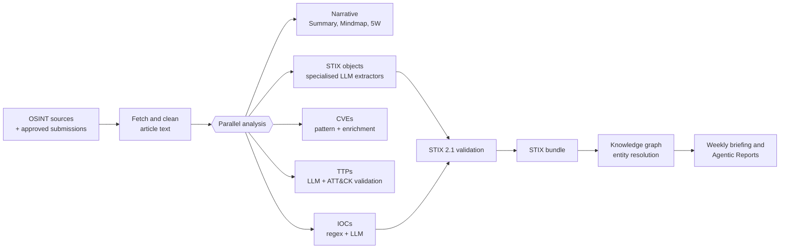

# How Content Is Generated

This page explains, in plain language, how each piece of content in TI Mindmap HUB is produced and how much you can rely on it. For the technical pipeline, see [Processing Methodology](methodology.md).

---

## The Approach in One Paragraph

TI Mindmap HUB reads public threat reports and uses **Large Language Models (LLMs)** to do what an analyst would do first: summarise, extract indicators and vulnerabilities, map behaviours to MITRE ATT&CK, and express everything as **STIX 2.1**. Wherever a deterministic method exists — pattern matching, schema validation, public enrichment feeds — the platform uses it **alongside** the LLM, not instead of it. The result is a fast first draft of structured intelligence that **a human must verify**.

---

## From Report to Intelligence

1. **Collect** — New articles are picked up from a curated list of security vendor blogs, government advisories, and research publications. Users can [submit URLs](../using-the-platform/submit-article.md), which are reviewed by a human first.
2. **Clean** — The page is fetched, boilerplate is removed, and the text is converted to clean Markdown. The original text is kept and shown in the **Source Report** tab.
3. **Analyse in parallel** — Several task-specific steps run on the same text, each with its own prompt and settings.
4. **Structure** — Results are expressed as STIX 2.1 objects, validated, and bundled.
5. **Connect** — Entities are merged into a cross-report knowledge graph.
6. **Synthesise** — Weekly briefings and Agentic Reports are written from many processed reports at once.

---

## Output by Output

| Output | How it's produced | Deterministic parts | What to verify |
|--------|-------------------|---------------------|----------------|
| **Dashboard teaser** | One-sentence LLM summary | — | Nothing critical; it's a teaser |
| **AI Summary** | LLM summary of the full article | — | Key facts against **Source Report** |
| **TI Mindmap** | LLM produces a hierarchical mindmap (limited number of main branches) | Syntax rules for rendering | Relationships between nodes |
| **5W Context** | LLM answers Who / What / When / Where / Why, with confidence and references | — | Attribution (*Who*) and motive (*Why*) |
| **IOCs** | Regex/pattern extraction **and** LLM extraction, then consolidation | Validation, refanging, deduplication, benign-domain and benign-IP filtering | Every indicator before blocking |
| **CVEs** | CVE IDs by pattern matching; LLM for per-report context | CVSS, EPSS, CISA KEV, exploit/patch/PoC enrichment | Report-specific context and actor links |
| **TTP Catalog** | LLM maps described behaviours to ATT&CK techniques | Technique IDs checked against ATT&CK | That each technique is actually described |
| **ATT&CK Heatmap** | Built from the TTP mapping as a Navigator-style layer | Layer format | Same as TTP Catalog |
| **STIX bundle** | Specialised LLM extractors for attack patterns, malware and actors, tools, indicators, and relationships | STIX 2.1 library validation; invalid objects and dangling relationships discarded | Relationships and attribution |
| **Diamond Model, Attack Flow** | Derived from the STIX bundle in your browser | Grouping by ATT&CK tactic order | Same as STIX bundle |
| **Knowledge graph** | STIX entities merged across reports | Alias merging, relationship counting | Merges and inferred relations |
| **Weekly Briefing** | Multi-agent LLM system over the week's reports | Aggregated counts | Trends and narrative |
| **Agentic Reports** | Agentic workflow correlating several processed reports | Source list with links | Conclusions against cited sources |
| **Statistics, Risk score** | Computed from the database | Fully deterministic | Interpretation only |

---

## IOC Confidence Explained

The **IOCs** tab shows only high- and medium-confidence indicators. Confidence is assigned by comparing the two extraction methods:

| Confidence | Rule | Meaning |
|------------|------|---------|
| **High** | Found by **both** pattern matching and the LLM | Present in the text *and* judged malicious in context |
| **Medium** | Found by the LLM only (for example, described in prose or partly obfuscated) | Likely relevant; check the context |
| **Low** | Found by pattern matching only, or a generic value such as a common user-agent | Often benign or incidental; kept in the JSON download only |

Before consolidation, indicators are refanged (`hxxp` → `http`, `[.]` → `.`), validated, and filtered: large cloud and software providers, common Windows binaries (LOLBins), standard paths, CLSIDs, documentation IP ranges, and the article's own URL are excluded.

---

## Model Settings

Each task uses its own prompt and a sampling temperature suited to the job:

| Task type | Temperature | Why |
|-----------|-------------|-----|
| Extraction (IOCs, TTPs, CVE context, ATT&CK layer) | Low (≈ 0.1–0.2) | Favour precision and repeatable output |
| Structuring (STIX objects, relationships, 5W) | Low–moderate (≈ 0.2–0.4) | Structured output with some interpretation |
| Narrative (summary, mindmap) | Moderate (≈ 0.4–0.7) | Readable, well-organised prose |

The LLMs are served through **Azure OpenAI**. Your data is not used to train models.

---

## What the AI Does Not Do

- It does **not** browse the web for extra context when analysing a report — outputs are based on the article text (plus the public enrichment sources listed above for CVEs)
- It does **not** attribute activity that the report does not attribute — but mistakes can still happen
- It does **not** check whether an IOC is currently active or malicious today
- It does **not** replace an analyst's judgement

---

## Human in the Loop

- User submissions are approved by a human before processing
- Outputs are sampled periodically to refine prompts and filters
- Every output links back to its source, so you can verify it in seconds
- You can report problems through [Feedback](https://ti-mindmap-hub.com/feedback) or [GitHub Issues](https://github.com/TI-Mindmap-HUB-Org/ti-mindmap-hub-research/issues)

!!! warning "Verify before acting"
    AI-generated intelligence is a starting point. Always check critical items against the **Source Report** before using them in detection, blocking, or reporting. See [Known Limitations](limitations.md).

---

## Related

- [Processing Methodology](methodology.md) — pipeline stages in detail
- [STIX 2.1 Data Model](data-model.md) — object types and relationships
- [Using the Platform](../using-the-platform/index.md) — where each output appears in the UI
- [Glossary](glossary.md) — terms used across the platform
