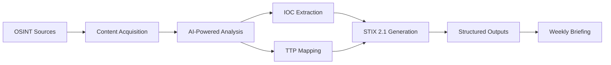

# Concepts

This section explains how TI Mindmap HUB works at a conceptual level — from ingestion through structured output — without exposing sensitive implementation details.

---

## High-Level Pipeline

The platform processes threat intelligence through six stages:

1. **Content Acquisition** — Curated OSINT sources are monitored; new articles are retrieved, cleaned, and stored with metadata.
2. **AI-Powered Analysis** — LLMs generate summaries, mindmaps, and structured reports from cleaned content.
3. **IOC Extraction** — Pattern matching combined with LLM analysis identifies indicators (IPs, domains, hashes, CVEs).
4. **TTP Mapping** — Behaviors described in reports are mapped to MITRE ATT&CK techniques.
5. **STIX 2.1 Generation** — Extracted entities and relationships are assembled into STIX 2.1 bundles.
6. **Weekly Briefing** — A multi-agent system aggregates and synthesizes the week's intelligence into a trend-focused briefing.

For full details, see [Processing Methodology](methodology.md).

---

## Data Model

The primary structured output is a **STIX 2.1 bundle** containing:

- **Report** — Container linking all intelligence from a single source
- **Threat Actor** — Named threat groups or individuals
- **Malware** — Malware families and tools
- **Indicator** — IOCs with STIX patterns (IPs, domains, hashes)
- **Attack Pattern** — MITRE ATT&CK techniques
- **Vulnerability** — CVE identifiers
- **Relationship** — Connections between the above objects

For detailed object specifications and examples, see [STIX 2.1 Data Model](data-model.md).

---

## Design Principles

- **Transparency** — All limitations are documented openly. See [Known Limitations](limitations.md).
- **Interoperability** — STIX 2.1 enables integration with any compliant SIEM, SOAR, or TIP.
- **Verification first** — Outputs are research-grade and require human review before operational use.
- **Open research** — Methodology and evaluation results are published for peer review.

---

## In This Section

- [Processing Methodology](methodology.md) — Detailed six-stage pipeline description
- [STIX 2.1 Data Model](data-model.md) — Object types, patterns, and integration guides
- [Known Limitations](limitations.md) — Comprehensive transparency on AI limitations
