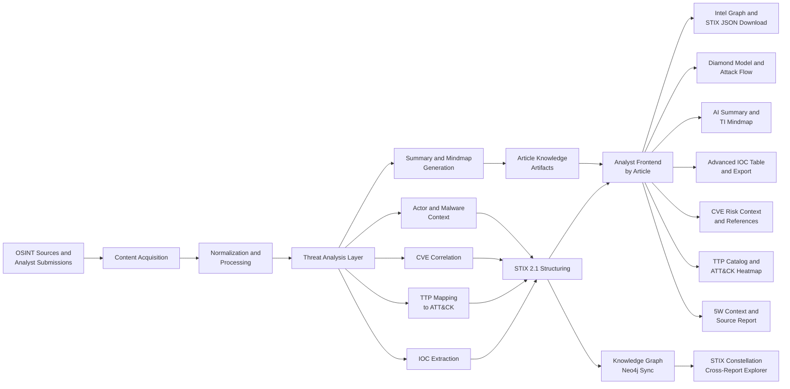
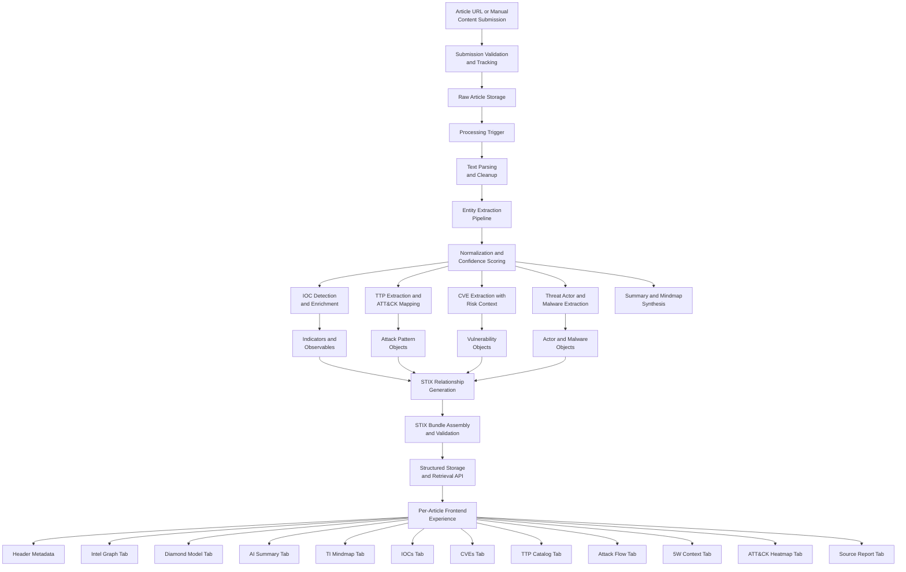

# Concepts

This section explains how TI Mindmap HUB works at a conceptual level — from ingestion through structured output and analyst-facing experience — without exposing sensitive implementation details.

---

## High-Level Pipeline

The platform processes threat intelligence through a multi-stage pipeline:

1. **Content Acquisition** — OSINT sources are continuously monitored and analyst submissions are accepted via the web interface or MCP `submit_article` tool.
2. **Normalization and Processing** — Raw content is cleaned, parsed, and prepared for analysis.
3. **Threat Analysis Layer** — LLMs perform parallel extraction and synthesis across five specialized branches:
    - **IOC Extraction** — Indicators of Compromise (IPs, domains, hashes, emails) with confidence scoring
    - **TTP Mapping** — Behavioral mapping to MITRE ATT&CK techniques and tactics
    - **CVE Correlation** — Vulnerability extraction with risk context (CVSS, exploit status, patch availability)
    - **Actor and Malware Context** — Threat actor attribution and malware family identification
    - **Summary and Mindmap Generation** — AI-powered summaries and visual threat models
4. **STIX 2.1 Structuring** — Extracted entities and relationships are assembled into validated STIX 2.1 bundles.
5. **Knowledge Graph Sync** — STIX entities are deduplicated and synced to Neo4j as canonical entities, enabling cross-report correlation via the [STIX Constellation](../outputs/knowledge-graph.md).
6. **Analyst Frontend** — All outputs converge into a per-article experience with multiple analysis tabs, plus a cross-report Knowledge Graph explorer.

---

## Detailed Pipeline

### Ingestion

1. **Article URL or Manual Submission** — Reports enter the pipeline via OSINT monitoring, the web submission form, or the MCP `submit_article` tool.
2. **Submission Validation and Tracking** — The URL is validated, deduplicated, and assigned a tracking identifier.
3. **Raw Article Storage** — Original content is preserved for reference and reproducibility.
4. **Processing Trigger** — The article is queued for automated analysis.

### Normalization

5. **Text Parsing and Cleanup** — HTML is stripped, content is converted to clean text, and metadata (source, date, URL) is preserved.
6. **Entity Extraction Pipeline** — LLMs and pattern matchers identify candidate entities across the text.
7. **Normalization and Confidence Scoring** — Extracted entities are validated, deduplicated, and assigned confidence levels (high, medium, low).

### Analysis Branches

The analysis layer processes five extraction branches in parallel:

| Branch | Input | Output | Key Details |
|--------|-------|--------|-------------|
| **IOC Detection and Enrichment** | Normalized text | IPs, domains, URLs, hashes, emails | Regex + LLM hybrid; whitelisting filters benign infrastructure |
| **TTP Extraction and ATT&CK Mapping** | Report behaviors | Technique IDs, tactics, confidence | Behavioral analysis, not keyword matching |
| **CVE Extraction with Risk Context** | Vulnerability mentions | CVE IDs with CVSS, exploit status, patch/PoC | Cross-referenced with enrichment sources |
| **Threat Actor and Malware Extraction** | Attribution context | Named groups, malware families, tools | Contextual extraction preserving relationships |
| **Summary and Mindmap Synthesis** | Full report content | AI summary, visual mindmap, 5W analysis | Concise analytical artifacts for rapid triage |

### STIX 2.1 Structuring

The backend assembles all extraction outputs — IOCs, CVEs, TTPs, actors, and malware — into a unified STIX 2.1 bundle:

8. **STIX Relationship Generation** — Semantic relationships (`uses`, `indicates`, `attributed-to`, `exploits`) are created between extracted objects.
9. **STIX Bundle Assembly and Validation** — Objects are assembled into a STIX 2.1 bundle, validated against the JSON Schema and pattern syntax.
10. **Structured Storage and Retrieval API** — Bundles and artifacts are stored and made available via the web interface, MCP tools, and REST API.

---

## Per-Article Frontend Experience

For each processed article, the analyst frontend presents a comprehensive analysis through a tabbed interface:

### Header Metadata

Every article page displays: **title**, **source**, **publication date**, **link to original report**, **bookmark**, and **PDF export**.

### Analysis Tabs

| Tab | Description |
|-----|-------------|
| **Intel Graph** | Interactive STIX relationship graph with graph view and JSON view. Displays object count and provides STIX bundle download. |
| **Diamond Model** | Diamond Model visualization mapping adversary, capability, infrastructure, and victim. |
| **AI Summary** | AI-generated technical summary of the report. |
| **TI Mindmap** | Interactive mindmap connecting threat actors, campaigns, malware, TTPs, IOCs, and targeted sectors. |
| **IOCs** | Advanced IOC table showing only **high and medium confidence** indicators, with JSON export. Low-confidence IOCs remain available in the downloadable file. |
| **CVEs** | Vulnerability details including **CVSS severity**, **exploited/patch/PoC status**, affected products, and correlated references. |
| **TTP Catalog** | Complete catalog of MITRE ATT&CK techniques identified in the report. |
| **Attack Flow** | Probable attack execution sequence reconstructed from the report. |
| **5W Context** | Structured root-cause analysis (Who, What, When, Where, Why). |
| **ATT&CK Heatmap** | Visual heatmap of mapped ATT&CK techniques across tactics. |
| **Source Report** | Original report content for reference and verification. |

---

## Data Model

The primary structured output is a **STIX 2.1 bundle** containing:

- **Report** — Container linking all intelligence from a single source
- **Threat Actor** — Named threat groups or individuals
- **Malware** — Malware families and tools
- **Indicator** — IOCs with STIX patterns (IPs, domains, hashes)
- **Attack Pattern** — MITRE ATT&CK techniques
- **Vulnerability** — CVE identifiers with risk context
- **Relationship** — Connections between the above objects

For detailed object specifications and examples, see [STIX 2.1 Data Model](data-model.md).

---

## Design Principles

- **Transparency** — All limitations are documented openly. See [Known Limitations](limitations.md).
- **Interoperability** — STIX 2.1 enables integration with any compliant SIEM, SOAR, or TIP.
- **Verification first** — Outputs are research-grade and require human review before operational use.
- **Open research** — Methodology and evaluation results are published for peer review.

---

## In This Section

- [Processing Methodology](methodology.md) — Detailed pipeline stages and technology stack
- [STIX 2.1 Data Model](data-model.md) — Object types, patterns, and integration guides
- [Known Limitations](limitations.md) — Comprehensive transparency on AI limitations
