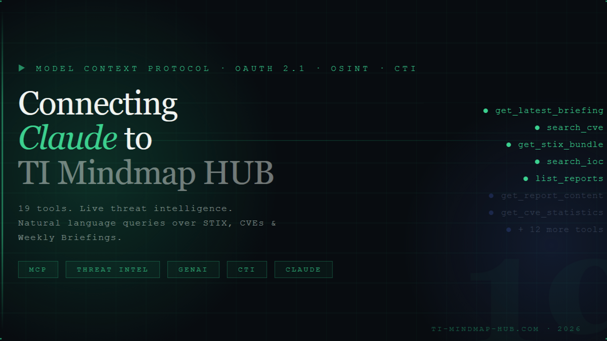
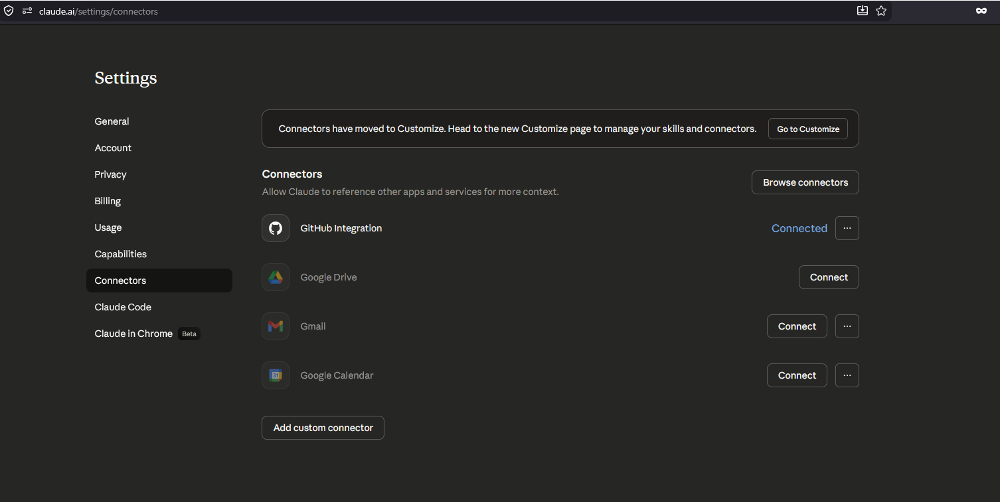
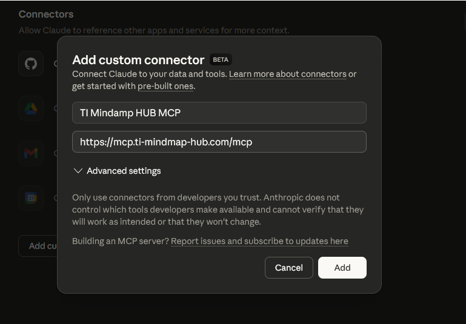
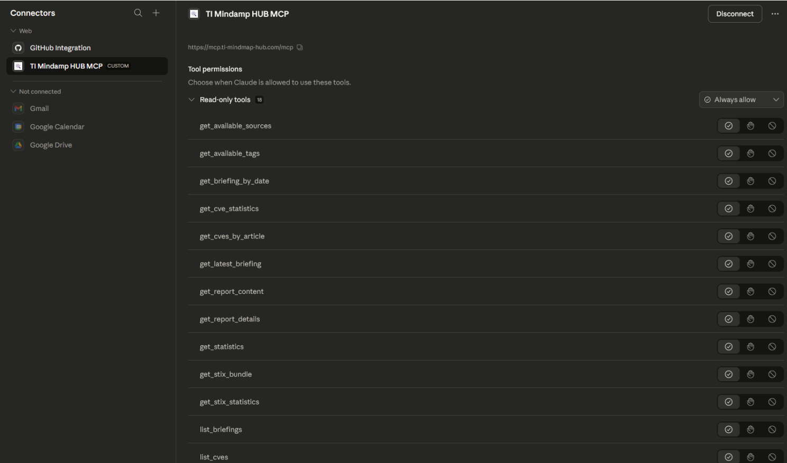
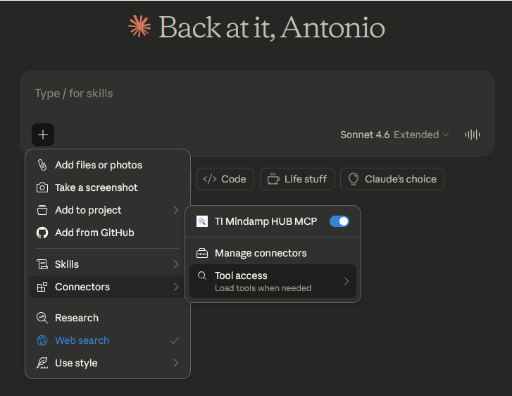
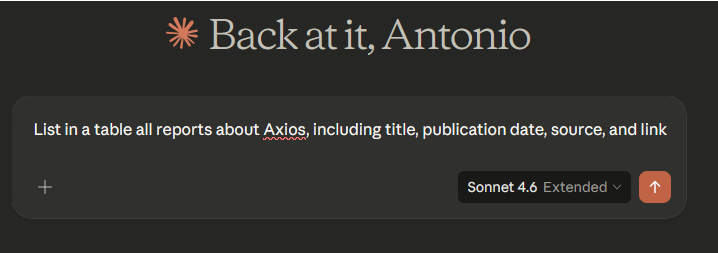

title: Claude Setup
description: Connect Claude to TI Mindmap HUB via MCP using Claude's custom connector flow and OAuth.
---

# Claude Setup

Connect Claude to TI Mindmap HUB's threat intelligence platform via MCP using Claude's native custom connector flow.

## Prerequisites

- Access to **Claude** with custom connectors enabled
- A **TI Mindmap HUB** account so you can complete the OAuth sign-in flow
- The MCP endpoint URL: `https://mcp.ti-mindmap-hub.com/mcp`

## Overview

TI Mindmap HUB now connects to Claude through a native MCP connector. You no longer need to download a local bridge script, edit Claude config files, or paste an API key into Claude.

Claude opens the MCP endpoint directly and handles the OAuth 2.1 authorization flow automatically. TI Mindmap HUB uses Azure AD B2C for authentication, so the only required connector input is the server URL.



_Cover image from the March 2026 TI Mindmap HUB blog post introducing the Claude MCP connector flow._

## Setup

### 1. Open Claude Connector Settings

In Claude, go to `Settings` -> `Connectors`.

Claude may show a banner explaining that connectors are now managed from the new `Customize` page. You can continue from either location.



_Claude Connectors settings page, including the entry point for adding a custom connector._

### 2. Add a Custom Connector

Click `Add custom connector` and enter:

- **Name**: `TI Mindmap HUB MCP`
- **URL**: `https://mcp.ti-mindmap-hub.com/mcp`

That is all you need to configure manually. Claude starts the OAuth flow when it connects to the server.



_Custom connector dialog populated with the TI Mindmap HUB MCP name and endpoint URL._

### 3. Complete OAuth Sign-In

When Claude prompts for authorization:

1. Sign in to your TI Mindmap HUB account.
2. Complete the OAuth consent flow.
3. Return to Claude after authorization finishes.

No API key needs to be copied into Claude, and no local connector file is required.

### 4. Review Tool Permissions

After the connector is added, Claude lists the tools exposed by the TI Mindmap HUB MCP server and lets you configure them individually.

For each tool, you can choose whether to:

- Always allow it
- Ask for confirmation
- Disable it

In Claude's current OAuth connector flow, the permissions screen exposes the TI Mindmap HUB tools directly so you can keep tight control over what the assistant may call.



_Claude tool permissions view for the TI Mindmap HUB connector, showing the available read-only tools._

### 5. Enable the Connector in a Conversation

Open a chat, click the `+` button, then go to `Connectors` and enable `TI Mindmap HUB` for that conversation.

You can also adjust tool access behavior there, depending on whether you want Claude to load tools on demand or keep them readily available in the conversation.



_Conversation-level connector controls for enabling TI Mindmap HUB and adjusting tool access behavior._

### 6. Start Querying Threat Intelligence

Once the connector is enabled, Claude can answer natural language questions using live TI Mindmap HUB data.



_Example of a natural-language Claude prompt that queries TI Mindmap HUB data through the MCP connector._

## Example Prompts

**Threat Research:**
```text
Show me the latest ransomware reports from the past week
```

**CVE Investigation:**
```text
Search for CVE-2024-3400 and explain its severity and impact
```

**Weekly Review:**
```text
What are the key highlights from the latest weekly threat briefing?
```

**IOC Lookup:**
```text
Search for any reports mentioning the domain evil.example.com
```

**Deep Dive:**
```text
Get the MITRE ATT&CK techniques and STIX bundle for report [id]
```

## What Claude Can Access

After connection, Claude can enumerate the MCP tools exposed by TI Mindmap HUB, including workflows for:

- Threat intelligence reports
- Weekly briefings
- IOC search
- CVE enrichment
- STIX bundles
- Platform statistics

The March 2026 Claude connector flow described in the TI Mindmap HUB blog shows 18 configurable tools in Claude's permissions interface.

## Troubleshooting

### Connector Not Connecting

1. Verify the connector URL is exactly `https://mcp.ti-mindmap-hub.com/mcp`.
2. Remove and recreate the custom connector if the first connection attempt was interrupted.
3. Confirm your Claude plan or workspace has access to custom connectors.

### OAuth Window Does Not Complete

1. Make sure your browser allows the sign-in and consent popup to open.
2. Complete the TI Mindmap HUB sign-in flow in the same browser session Claude opened.
3. Retry the connection from Claude after the browser flow finishes.

### Tools Do Not Appear in Chat

1. Open the chat composer, click `+`, then `Connectors`, and verify `TI Mindmap HUB` is enabled for the conversation.
2. Check the connector's tool permissions and confirm the needed tools are not disabled.
3. Start a new conversation after changing connector permissions.

### Authorization Errors

1. Make sure you completed the TI Mindmap HUB OAuth sign-in with the intended account.
2. Revoke the connector authorization and reconnect if consent may be stale.
3. If your TI Mindmap HUB account access changed recently, sign out and repeat the OAuth flow.

## Security

- Claude does not require a hardcoded TI Mindmap HUB API key for this setup.
- Authentication is handled through OAuth 2.1.
- Access can be controlled from Claude connector permissions and from the TI Mindmap HUB account side.
- Tool access remains conversation-scoped until you enable the connector in a chat.

## Legacy Configuration Notice

This page replaces the previous Claude setup based on a local Node.js bridge and manual API key injection. Claude should now be configured through the native connector flow described above.

## Support

- **MCP Server Documentation**: [MCP Server](server.md)
- **Issues**: [GitHub Issues](https://github.com/TI-Mindmap-HUB-Org/ti-mindmap-hub-research/issues)
- **Email**: [info@ti-mindmap-hub.com](mailto:info@ti-mindmap-hub.com)
