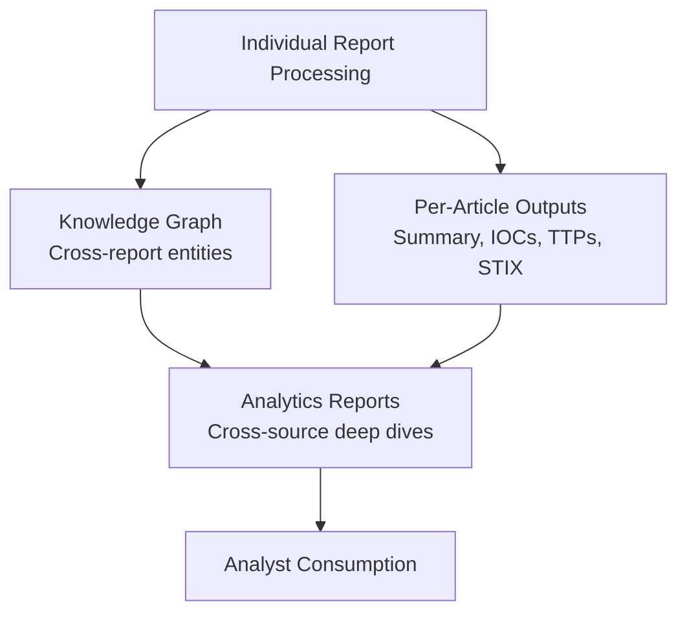

# Analytics Reports

Analytics Reports are long-form, cross-source intelligence analyses that go beyond individual report processing. They correlate data across multiple reports, sources, and timeframes to provide deeper insight into significant threats, campaigns, and vulnerabilities.

---

## Overview

While the standard processing pipeline generates per-article outputs, Analytics Reports are authored analyses that:

- **Correlate multiple sources** — Draw from 2–10+ original reports
- **Provide deeper context** — Extended analysis with geopolitical, economic, or sector-specific context
- **Track evolving threats** — Follow campaigns as they develop over days or weeks
- **Include severity classification** — Rated CRITICAL, HIGH, MEDIUM, LOW, or INFORMATIONAL

---

## Report Structure

Each Analytics Report includes:

| Field | Description |
|-------|-------------|
| Title | Descriptive title of the analysis |
| Date | Publication date |
| Severity | Risk classification (CRITICAL → INFORMATIONAL) |
| Classification | Report type (e.g., Supply Chain, APT Campaign, Vulnerability Analysis) |
| Description | Executive summary |
| Tags | Relevant keywords and identifiers |
| Sources Count | Number of correlated source reports |
| Author | Analyst or system attribution |

---

## Example Reports

| Report | Severity | Classification |
|--------|----------|----------------|
| TeamPCP Supply Chain Threat Intelligence | HIGH | Supply Chain Attack |
| Axios NPM Supply Chain Attack | CRITICAL | Supply Chain Attack |
| Iran Conflict Cyber Threat Escalation | HIGH | Geopolitical Threat |
| CopyFail CVE-2026-31431 Cross-Source Analysis | CRITICAL | Vulnerability Analysis |

---

## Access

Analytics Reports are accessible via:

- **Web interface** — Browse from the **Analytics** page with search, severity filter, and classification filter
- **Direct URL** — Each report has a permanent URL at `/analytics/{slug}`

---

## Relationship to Standard Outputs

Analytics Reports are complementary to the automated pipeline:

- **Automated outputs** provide speed and coverage
- **Analytics Reports** provide depth and correlation
- Together they offer both breadth and depth of intelligence coverage

---

## Severity Levels

| Level | Meaning |
|-------|---------|
| CRITICAL | Immediate, widespread impact; active exploitation |
| HIGH | Significant threat with confirmed activity |
| MEDIUM | Notable threat requiring awareness |
| LOW | Limited impact or early-stage threat |
| INFORMATIONAL | Context and background; no immediate action required |
