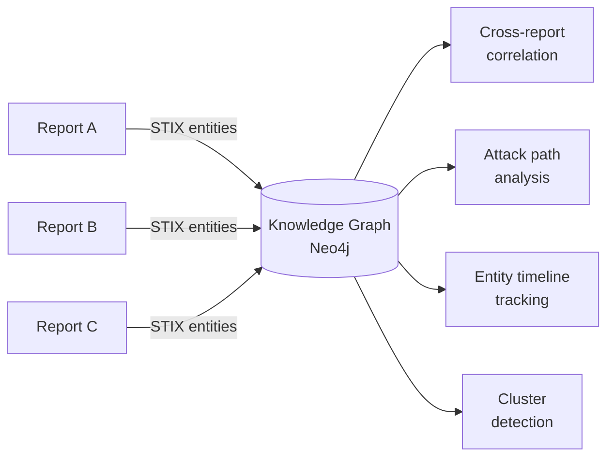

# Knowledge Graph — STIX Constellation

The Knowledge Graph (internally called **STIX Constellation**) is a Neo4j-backed graph database that unifies STIX entities and relationships across all processed threat intelligence reports, enabling cross-report correlation and attack path analysis.

---

## Overview

While individual STIX bundles describe a single report in isolation, the Knowledge Graph connects entities **across reports** — revealing patterns, shared infrastructure, and campaign overlaps that no single report can show on its own.

---

## Graph Schema

The graph uses **canonical entities** — deduplicated nodes that represent a single real-world entity (threat actor, malware family, tool, etc.) even when it appears in multiple reports under different names or aliases.

### Node Types

| Label | Description | Example |
|-------|-------------|---------|
| `Report` | A processed threat intelligence article | "APT28 Targets NATO Allies" |
| `CanonEntity` | Deduplicated real-world entity | "Forest Blizzard" (with aliases: APT28, Fancy Bear) |

Canon entities carry a `type` property indicating their STIX type:

- `ThreatActor` — Named threat groups and APTs
- `Malware` — Malware families
- `Tool` — Offensive tools (Cobalt Strike, Mimikatz, etc.)
- `AttackPattern` — MITRE ATT&CK techniques
- `Indicator` — IOCs (IPs, domains, hashes)
- `Identity` — Targeted organizations or sectors
- `Vulnerability` — CVE identifiers

### Relationship Types

| Relationship | Direction | Description |
|-------------|-----------|-------------|
| `OBSERVED_REL` | `CanonEntity` → `CanonEntity` | Observed relationship (uses, targets, exploits, etc.) |
| `APPEARS_IN` | `CanonEntity` → `Report` | Entity was mentioned in report |
| `INFERRED_REL` | `CanonEntity` → `CanonEntity` | AI-inferred relationship with confidence score |

---

## API Endpoints

The Knowledge Graph is exposed via the `/api/kg/` router:

| Endpoint | Method | Description |
|----------|--------|-------------|
| `/api/kg/stats` | GET | Graph-wide statistics (node counts, top entities, type distribution) |
| `/api/kg/search` | GET | Search canon entities by name, alias, or type |
| `/api/kg/cluster` | GET | Get the local subgraph around a specific entity |
| `/api/kg/timeline` | GET | Track an entity's appearances across reports over time |
| `/api/kg/attack-paths` | GET | Discover multi-hop attack paths between entities |
| `/api/kg/cross-report` | GET | Find entities shared across multiple reports |

All endpoints require authentication (Bearer token or API key).

---

## Frontend Experience

The Knowledge Graph is accessible from the **Knowledge Graph** page in the web interface. It provides:

### Graph Statistics
- Total reports indexed
- Canon entity count
- Observed and inferred relationship counts
- Top entities by report frequency
- Entity type distribution

### Entity Search
- Full-text search across entity names and aliases
- Filter by entity type
- View report count per entity

### Cluster View
- Select an entity to visualize its local neighborhood
- Interactive graph rendered with Cytoscape
- Nodes colored by type, edges labeled with relationship kind
- Click-through to individual reports

### Timeline
- Track how an entity appears across reports over time
- Identify activity spikes or dormancy periods

### Attack Paths
- Query multi-hop paths between two entities
- Discover indirect connections (e.g., Actor → Tool → Technique → Victim)
- Path results rendered as directed graphs

### Cross-Report Correlation
- View entities that appear in the most reports
- Identify shared infrastructure, tools, or techniques across campaigns

---

## Entity Resolution

Canonical entities are created through a deduplication process:

1. STIX objects are extracted from each report
2. Entity names are normalized (case, whitespace, common alias patterns)
3. Known aliases are merged (e.g., "APT28" = "Fancy Bear" = "Forest Blizzard")
4. A blacklist filters known false-positive entities
5. Merged entities receive a stable canonical ID

---

## Use Cases

- **Campaign tracking** — Follow a threat actor across all reports mentioning them or their aliases
- **Tool overlap detection** — Find threat actors using the same tools or infrastructure
- **TTP correlation** — Identify techniques commonly used together
- **IOC pivoting** — Start from an indicator and discover connected actors and campaigns
- **Trend analysis** — Track entity activity over time to spot emerging threats

---

## Limitations

- Entity resolution depends on the quality of STIX extraction from individual reports
- Inferred relationships carry confidence scores and should be verified
- The graph reflects only what has been processed — not all global threat intelligence
- Blacklisted entities (known false positives) are excluded from query results

!!! info "Experimental Feature"
    The Knowledge Graph is under active development. Entity resolution accuracy and relationship inference are continuously being improved.
