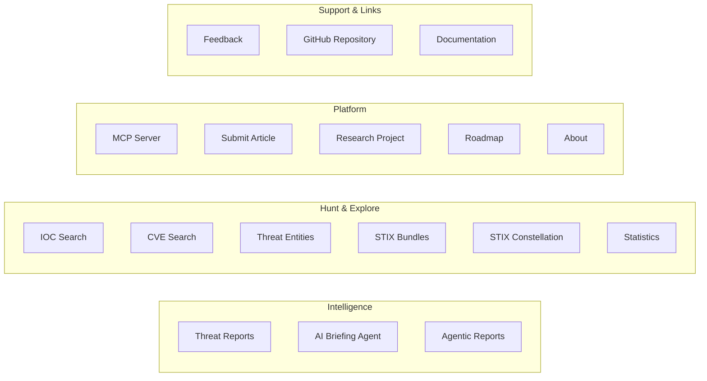

# Using the Platform

This section is a practical guide to the TI Mindmap HUB web interface at [ti-mindmap-hub.com](https://ti-mindmap-hub.com). Each page explains what you see, what you can do, and how the content was produced.

!!! warning "AI-generated content"
    Summaries, mindmaps, IOCs, TTP mappings, STIX bundles, and briefings are generated by AI. Always verify critical information against the original source before operational use. See [Known Limitations](../concepts/limitations.md).

---

## Public vs. Authenticated Pages

Most of the platform requires a free account. A few pages are open to everyone.

| Page | Path | Sign-in required |
|------|------|:----------------:|
| Sign-in screen | shown for any protected page | — |
| [Landing page](account-and-access.md#public-pages) | `/landingpage` | No |
| [Research Project](account-and-access.md#public-pages) | `/research` | No |
| [Agentic Reports](agentic-reports.md) | `/analytics`, `/analytics/{slug}` | No |
| Terms of Service / Privacy Policy | `/terms`, `/privacy` | No |
| Everything else (dashboard, reports, search, graph, briefing, MCP, profile) | — | **Yes** |

If you open a link to a protected page while signed out, you see the sign-in screen. After you sign in, you are taken back to the page you originally requested. See [Account & Access](account-and-access.md).

---

## Navigation Map

The sidebar groups pages into four areas.

| Sidebar entry | What it is for | Guide |
|---------------|----------------|-------|
| **Threat Reports** | Browse and search every processed report | [Threat Reports Dashboard](dashboard.md) |
| *(open any report)* | 12-tab analysis of a single report | [Report View](report-view.md) |
| **AI Briefing Agent** | Weekly AI-generated threat landscape | [Weekly Briefing](weekly-briefing.md) |
| **Agentic Reports** | Cross-source deep-dive analyses (public) | [Agentic Reports](agentic-reports.md) |
| **IOC Search** | Look up indicators, bulk triage, CSV export | [IOC Search](ioc-search.md) |
| **CVE Search** | Vulnerabilities with KEV/EPSS context, patch priority | [CVE Search](cve-search.md) |
| **Threat Entities** | Actor, malware, tool, and campaign profiles | [Threat Entities](threat-entities.md) |
| **STIX Bundles** | Browse, preview, and download STIX 2.1 bundles | [STIX Bundles](stix-bundles.md) |
| **STIX Constellation** | Interactive cross-report knowledge graph | [STIX Constellation](stix-constellation.md) |
| **Statistics** | Platform-wide metrics and charts | [Statistics](statistics.md) |
| **MCP Server** | Connect AI assistants to the platform | [MCP](../mcp/index.md) |
| **Submit Article** | Propose a new report for analysis | [Submit an Article](submit-article.md) |
| **Research Project**, **Roadmap**, **About** | Project context and plans | [Account & Access](account-and-access.md#other-pages) |
| **Feedback** | Contact channels, issues, discussions | [Account & Access](account-and-access.md#other-pages) |

The user menu (top right) gives access to **My Profile**, where you manage your profile, newsletter subscription, and MCP API keys.

---

## Typical Workflows

### Triage a new threat report

1. Find the report in [Threat Reports](dashboard.md) (or [submit it](submit-article.md))
2. Read **AI Summary**, **TI Mindmap**, and **5W Context** in the [Report View](report-view.md)
3. Review **IOCs**, **CVEs**, and **TTP Catalog**
4. Export the STIX bundle, MISP event, or PDF

### Check whether an indicator is known

1. Paste it into [IOC Search](ioc-search.md) — or paste up to 500 indicators into **Bulk IOC Triage**
2. Open the matching reports and linked entities

### Prioritise patching

1. Open [CVE Search](cve-search.md) and review **Patch Priority**
2. Filter results with **Only CISA KEV**
3. Open the reports that mention each CVE for context

### Profile an adversary

1. Search the actor in [Threat Entities](threat-entities.md)
2. Review exploited CVEs, ATT&CK techniques, and associated IOCs on the profile
3. Explore relationships in the [STIX Constellation](stix-constellation.md)

### Stay current

1. Read the latest [Weekly Briefing](weekly-briefing.md)
2. Browse [Agentic Reports](agentic-reports.md) for deep dives
3. Subscribe to the weekly newsletter in **My Profile**

---

## How the Content Is Produced

Every page in this section includes a short "How it's generated" note. For the full picture, see:

- [How Content Is Generated](../concepts/how-content-is-generated.md) — one-page overview for end users
- [Processing Methodology](../concepts/methodology.md) — detailed pipeline stages
- [Known Limitations](../concepts/limitations.md) — what to verify and why
