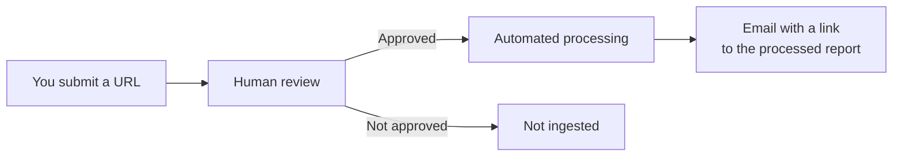

# Submit an Article

**Sidebar:** Platform → **Submit Article** · **Path:** `/submit` · **Sign-in required**

Most reports are ingested automatically from curated OSINT sources. If you find a relevant report that is not in the platform yet, you can propose it.

---

## Steps

1. Check the [dashboard](dashboard.md) first — search by title or keyword to make sure the report is not already there
2. Open **Submit Article**
3. Paste the public URL in **Article URL** (for example, `https://example.com/threat-report`)
4. Click **Submit URL**

A confirmation message appears and the field clears, so you can submit another URL.

---

## What Happens Next

1. **Human review** — every submission is checked by a person before it enters the processing pipeline. Allow some time for approval
2. **Processing** — once approved, the article goes through the full pipeline (summary, mindmap, IOCs, CVEs, TTPs, STIX, knowledge graph)
3. **Notification** — you receive an email from `info@ti-mindmap-hub.com` with a direct link to the processed report

---

## What Makes a Good Submission

| Good candidates | Poor candidates |
|-----------------|-----------------|
| Vendor threat research, incident write-ups, government advisories | Marketing pages, product announcements |
| Reports with technical detail (IOCs, TTPs, CVEs) | Paywalled or login-protected content |
| Publicly accessible HTML pages | Social media posts with little content |
| Original research | Aggregated news that only links elsewhere |

The article must be publicly reachable: the pipeline fetches the page itself.

---

## Via MCP

AI assistants connected through the [MCP Server](../mcp/index.md) can submit URLs with the `submit_article` tool. MCP submissions enter the same submission workflow as the web form.
